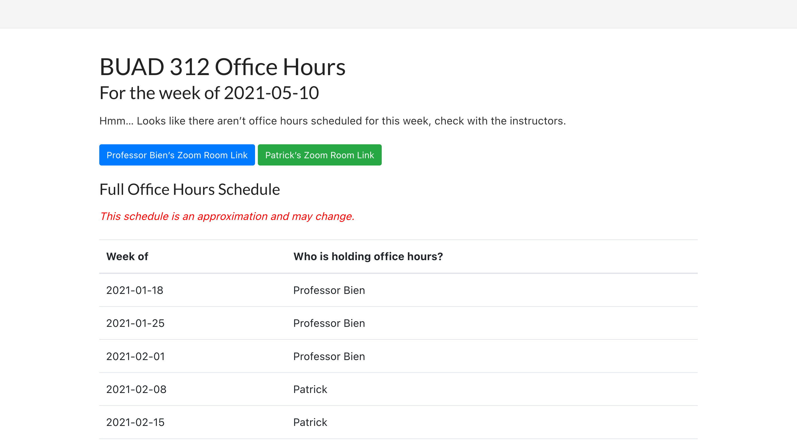
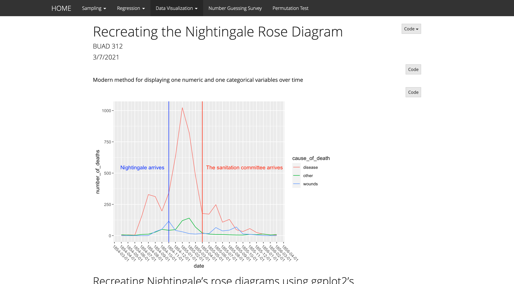
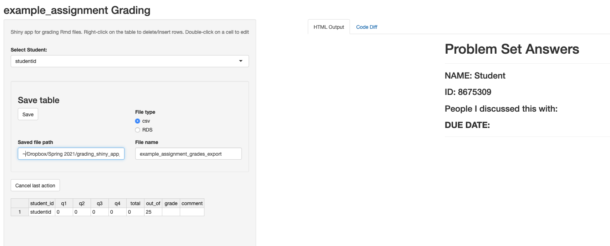

## Instructor:

* BUAD 312: Statistics and Data Science for Business, Spring 2021.
    * Co-taught with [Jacob Bien](http://faculty.marshall.usc.edu/Jacob-Bien/).
    * I made a `buad312data` [R package](https://github.com/BUAD312/BUAD_312_data) to make it easier to share data sets with students
    * I used blogdown to make [a website](https://patrickvossler18.github.io/buad_312_office_hour_info/2021/01/01/buad-312-oh-schedule/) for specifying which instructor is holding office hours
    
    * I made an [additional website](https://patrickvossler18.github.io/buad_312_files/index.html) to host supplementary files used during our lectures (this time using `rmarkdown::render_site()`) 

## Teaching Assistant:

* BUAD 312: Statistics and Data Science for Business, Spring 2020.
    * I developed [a shiny app](https://github.com/patrickvossler18/grading_shiny_app) for grading problem set submissions.
        * The app displays the knitted HTML file from students and shows the diff output of their .Rmd file compared to the template .Rmd file for the problem set.
    

